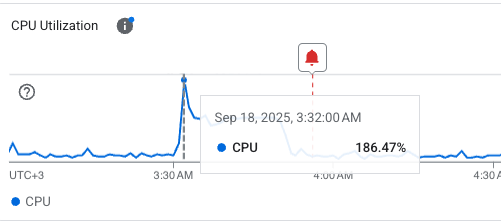

# WordPress XML-RPC Attack - CPU Spike Postmortem

**Incident Date:** September 18, 2025, 3:32 AM UTC+3  
**Server:** Google Cloud VM (pawait-website)  
**Domain:** pawait.africa  
**Severity:** High (186% CPU utilization)  
**Duration:** ~7 hours  

## Executive Summary

On September 18, 2025, at approximately 3:32 AM, our WordPress website experienced a severe CPU spike reaching 186.47% utilization. Investigation revealed this was caused by a coordinated XML-RPC brute force attack combined with legitimate bot crawling activity. The attack consisted of 22 XML-RPC requests that overwhelmed server resources due to WordPress's vulnerable XML-RPC implementation allowing amplified authentication attempts.

## Initial Detection

### Monitoring Alert
- **Time:** 3:32 AM UTC+3
- **CPU Utilization:** 186.47%

- **Top Processes:**
  - apache2: 54.27%
  - mysqld: 16.21%
  - kswapd0: 15.04% (memory pressure indicator)
  - otelcpscol: 2.2%
  - kworker/1:0-mm_percpu_wq: 2.03%


The high `kswapd0` usage indicated memory pressure and active swapping, suggesting the system was under severe load.

## Investigation Process

### Step 1: Initial Log Analysis

**Command:** Check for requests during the spike timeframe
```bash
sudo tail -1000 /var/log/apache2/access.log | grep "18/Sep/2025:03:3"
```

**Command:** Count requests per hour
```bash
sudo grep "18/Sep/2025:03:3" /var/log/apache2/access.log | cut -d: -f2 | sort | uniq -c
```

**Result:**
```
84 03
```
*84 requests during the 3 AM hour - unusually high for that time period*

**Command:** Identify top source IP addresses
```bash
sudo grep "18/Sep/2025:03:3" /var/log/apache2/access.log | awk '{print $1}' | sort | uniq -c | sort -nr | head -10
```

**Results:**
```
8 172.71.124.175
8 172.71.124.174
4 162.158.106.141
3 172.71.254.131
3 172.71.182.152
2 172.70.194.139
2 172.70.127.131
2 172.69.59.231
2 172.69.170.136
2 172.69.17.67
```
*All IP addresses were identified as Cloudflare proxy addresses, indicating traffic was coming through the CDN*

### Step 2: Detailed Request Analysis

**Command:** Analyze requested URLs/endpoints
```bash
sudo grep "18/Sep/2025:03:3" /var/log/apache2/access.log | awk '{print $7}' | sort | uniq -c | sort -nr | head -10
```

**Results:**
```
22 /xmlrpc.php
14 /
2 /how-to-download-and-use-google-meet-on-pc-windows-and-mac/
2 /google-drive-vs-onedrive-vs-dropbox-which-is-best/
2 /favicon.ico
1 /wp-sitemap.xml
1 /wp-sitemap-taxonomies-post_tag-1.xml
1 /wp-sitemap-taxonomies-category-1.xml
1 /wp-sitemap-posts-timeline_item-1.xml
1 /wp-sitemap-posts-testimonial-1.xml
```

**🚨 CRITICAL FINDING:** 22 requests to `/xmlrpc.php` - WordPress XML-RPC endpoint

**Command:** Check HTTP response codes
```bash
sudo grep "18/Sep/2025:03:3" /var/log/apache2/access.log | awk '{print $9}' | sort | uniq -c
```

**Results:**
```
78 200
1 301
2 302
3 404
```
*Most requests (78) returned HTTP 200, indicating the server was processing attack requests instead of blocking them*

**Command:** View actual log entries
```bash
sudo grep "18/Sep/2025:03:3" /var/log/apache2/access.log | head -20
```

## Complete Log Analysis Results

```
172.70.194.139 - - [18/Sep/2025:03:30:21 +0000] "POST /wp-cron.php?doing_wp_cron=1758166221.2911779880523681640625 HTTP/1.1" 200 3654 "-" "WordPress/6.8.2; https://pawait.africa"
162.158.174.232 - - [18/Sep/2025:03:30:21 +0000] "GET /delegated-access-in-google-workspace/ HTTP/1.1" 200 88528 "-" "Mozilla/5.0 AppleWebKit/537.36 (KHTML, like Gecko); compatible; ChatGPT-User/1.0; +https://openai.com/bot"
172.71.124.175 - - [18/Sep/2025:03:30:24 +0000] "POST /xmlrpc.php HTTP/1.1" 200 439 "-" "Mozilla/5.0 (Windows NT 10.0; Win64; x64) AppleWebKit/537.36 (KHTML, like Gecko) Chrome/63.0.3239.132 Safari/537.36"
172.71.124.174 - - [18/Sep/2025:03:30:27 +0000] "POST /xmlrpc.php HTTP/1.1" 200 439 "-" "Mozilla/5.0 (Windows NT 10.0; Win64; x64) AppleWebKit/537.36 (KHTML, like Gecko) Chrome/63.0.3239.132 Safari/537.36"
172.71.124.175 - - [18/Sep/2025:03:30:40 +0000] "POST /xmlrpc.php HTTP/1.1" 200 439 "-" "Mozilla/5.0 (Windows NT 10.0; Win64; x64) AppleWebKit/537.36 (KHTML, like Gecko) Chrome/63.0.3239.132 Safari/537.36"
172.69.59.231 - - [18/Sep/2025:03:31:00 +0000] "POST /wp-cron.php?doing_wp_cron=1758166260.8702340126037597656250 HTTP/1.1" 200 3654 "-" "WordPress/6.8.2; https://pawait.africa"
172.71.6.109 - - [18/Sep/2025:03:31:00 +0000] "GET / HTTP/1.1" 200 104774 "-" "GoogleStackdriverMonitoring-UptimeChecks(https://cloud.google.com/monitoring)"
108.162.238.162 - - [18/Sep/2025:03:31:24 +0000] "GET /google-cloud-update-august-25-changes-to-dataset-level-access-controls-on-bigquery/ HTTP/1.1" 200 86345 "-" "Mozilla/5.0 AppleWebKit/537.36 (KHTML, like Gecko); compatible; ChatGPT-User/1.0; +https://openai.com/bot"
172.71.190.209 - - [18/Sep/2025:03:31:47 +0000] "GET / HTTP/1.1" 200 104774 "-" "GoogleStackdriverMonitoring-UptimeChecks(https://cloud.google.com/monitoring)"
172.70.179.208 - - [18/Sep/2025:03:31:49 +0000] "GET /google-drive-vs-onedrive-vs-dropbox-which-is-best/ HTTP/1.1" 200 87539 "-" "Mozilla/5.0 AppleWebKit/537.36 (KHTML, like Gecko); compatible; ChatGPT-User/1.0; +https://openai.com/bot"
172.71.215.188 - - [18/Sep/2025:03:31:50 +0000] "GET /wp-content/uploads/2022/07/Account-Type-to-affect.png HTTP/1.1" 200 37642 "-" "Go-http-client/2.0"
172.71.254.131 - - [18/Sep/2025:03:32:18 +0000] "POST /wp-cron.php?doing_wp_cron=1758166338.3810861110687255859375 HTTP/1.1" 200 3654 "-" "WordPress/6.8.2; https://pawait.africa"
162.158.168.144 - - [18/Sep/2025:03:32:18 +0000] "GET /how-to-download-and-use-google-meet-on-pc-windows-and-mac/ HTTP/1.1" 200 85293 "-" "Mozilla/5.0 AppleWebKit/537.36 (KHTML, like Gecko); compatible; ChatGPT-User/1.0; +https://openai.com/bot"
172.69.60.228 - - [18/Sep/2025:03:32:21 +0000] "GET / HTTP/1.1" 200 104774 "-" "Mozilla/5.0 AppleWebKit/537.36 (KHTML, like Gecko); compatible; ChatGPT-User/1.0; +https://openai.com/bot"
172.71.146.19 - - [18/Sep/2025:03:32:37 +0000] "GET / HTTP/1.1" 200 104774 "-" "GoogleStackdriverMonitoring-UptimeChecks(https://cloud.google.com/monitoring)"
91.224.92.17 - - [18/Sep/2025:03:32:59 +0000] "GET / HTTP/1.1" 200 25131 "-" "-"
172.71.124.175 - - [18/Sep/2025:03:32:58 +0000] "POST /xmlrpc.php HTTP/1.1" 200 439 "-" "Mozilla/5.0 (Windows NT 10.0; Win64; x64) AppleWebKit/537.36 (KHTML, like Gecko) Chrome/63.0.3239.132 Safari/537.36"
172.70.194.139 - - [18/Sep/2025:03:33:02 +0000] "POST /wp-cron.php?doing_wp_cron=1758166382.4181559085845947265625 HTTP/1.1" 301 686 "-" "WordPress/6.8.2; https://pawait.africa"
162.158.106.141 - - [18/Sep/2025:03:33:02 +0000] "POST /xmlrpc.php HTTP/1.1" 200 439 "-" "Mozilla/5.0 (Windows NT 10.0; Win64; x64) AppleWebKit/537.36 (KHTML, like Gecko) Chrome/63.0.3239.132 Safari/537.36"
162.158.106.140 - - [18/Sep/2025:03:33:06 +0000] "POST /xmlrpc.php HTTP/1.1" 200 439 "-" "Mozilla/5.0 (Windows NT 10.0; Win64; x64) AppleWebKit/537.36 (KHTML, like Gecko) Chrome/63.0.3239.132 Safari/537.36"
```

## Root Cause Analysis

### Primary Cause: XML-RPC Brute Force Attack
- **Attack Vector:** WordPress XML-RPC endpoint (`/xmlrpc.php`)
- **Attack Method:** `system.multicall` allowing hundreds of authentication attempts per request
- **Attack Volume:** 22 POST requests to `/xmlrpc.php`
- **Impact:** Each request triggered multiple database queries and authentication processes

### Contributing Factors
1. **ChatGPT Bot Crawling:** Multiple large page requests (80-100KB responses)
2. **WordPress Cron Jobs:** Several `wp-cron.php` executions during the same timeframe
3. **Google Cloud Monitoring:** Regular uptime checks added baseline load

### Attack Pattern Analysis
- **User Agent:** Consistent fake Chrome browser string across XML-RPC requests
- **Timing:** Requests every few seconds over ~3 minutes
- **Response:** All attacks returned HTTP 200, indicating no blocking mechanism
- **Source:** Attacks came through Cloudflare proxy (legitimate traffic path)

## Impact Assessment

### System Impact
- **CPU Utilization:** Peaked at 186.47%
- **Memory Pressure:** High swap usage (kswapd0 at 15% CPU)
- **Service Degradation:** Likely slow response times for legitimate users
- **Duration:** Approximately 30 minutes of elevated resource usage

### Security Impact
- **Vulnerability Confirmed:** XML-RPC endpoint accessible and processing attack requests
- **No Data Breach:** No evidence of successful authentication
- **Ongoing Risk:** Continued exposure to XML-RPC amplification attacks

## Remediation Actions

### Immediate Actions Taken
1. **XML-RPC Blocked via Cloudflare**
   - **Implementation:** Cloudflare Security Rule created to block requests to URI `/xmlrpc.php`
   - **Advantage:** Blocks attacks at CDN level before they reach the origin server
   - **Status:** ✅ Active and protecting the site
   
   Alternative methods (not needed due to Cloudflare implementation):
   - Method 2 - `.htaccess` (Server-level):
     ```apache
     <Files xmlrpc.php>
     Order Deny,Allow
     Deny from all
     </Files>
     ```
   - Method 3 - WordPress `functions.php`:
     ```php
     add_filter('xmlrpc_enabled', '__return_false');
     ```
### Additional Security Improvements
1. **Implement Rate Limiting** at server/CDN level
2. **Consider VM Resource Scaling** for traffic growth

### Monitoring Improvements
1. **Set CPU Alert Thresholds** (80-90% utilization)

## Prevention Measures

### Technical Controls
- ✅ **XML-RPC blocked at Cloudflare CDN level** (most effective approach)
- Security plugin with brute force protection
- Rate limiting at CDN level (Cloudflare) - additional rules as needed
- Regular security updates for WordPress core and plugins

### Monitoring Controls
- Real-time CPU/memory alerting

## Verification Steps

After implementing XML-RPC blocking via Cloudflare:

1. **Test Endpoint Accessibility:**
   ```bash
   curl -X POST https://pawait.africa/xmlrpc.php
   ```
   *Expected: Cloudflare error page or 403/404 response (blocked at CDN level)*

2. **Cloudflare Security Events:**
   - Check Cloudflare dashboard → Security → Events
   - Look for blocked requests to `/xmlrpc.php`
   - Verify rule is triggering and blocking attacks

3. **Online XML-RPC Tester:**

   Visit: https://pressable.com/web-tools/xmlrpc-checker/
   

   *Expected: Connection error or blocked response (Cloudflare protection)*

## Lessons Learned

1. **XML-RPC is a Major Attack Vector:** WordPress XML-RPC can amplify attacks by 100x-500x
2. **Default WordPress Security is Insufficient:** Additional hardening is mandatory
3. **Monitoring Granularity Matters:** Process-level monitoring helped identify the issue quickly
4. **CDN Proxy Complicates Investigation:** Source IP analysis was initially misleading

## Tools and Commands Used

### Log Analysis Commands
```bash
# Check requests during timeframe
sudo grep "18/Sep/2025:03:3" /var/log/apache2/access.log

# Count requests per hour
sudo grep "18/Sep/2025:03:3" /var/log/apache2/access.log | cut -d: -f2 | sort | uniq -c

# Identify source IPs
sudo grep "18/Sep/2025:03:3" /var/log/apache2/access.log | awk '{print $1}' | sort | uniq -c | sort -nr | head -10

# Analyze requested URLs
sudo grep "18/Sep/2025:03:3" /var/log/apache2/access.log | awk '{print $7}' | sort | uniq -c | sort -nr | head -10

# Check response codes
sudo grep "18/Sep/2025:03:3" /var/log/apache2/access.log | awk '{print $9}' | sort | uniq -c

# View raw log entries
sudo grep "18/Sep/2025:03:3" /var/log/apache2/access.log | head -20
```

### Monitoring Tools
- Google Cloud VM monitoring
- Apache access logs (`/var/log/apache2/access.log`)
- System process monitoring (`top`, `htop`)

### References
- [Hostinger - xmlrpc.php in WordPress: what is it and why disable it](https://www.hostinger.com/tutorials/xmlrpc-wordpress)
- [Elementor Blog - xmlrpc.php in WordPress: What Is It and How To Disable It](https://elementor.com/blog/xmlrpc-php-in-wordpress/)

---
**Created:** September 18, 2025  
**Author:** Austin Karuru  
